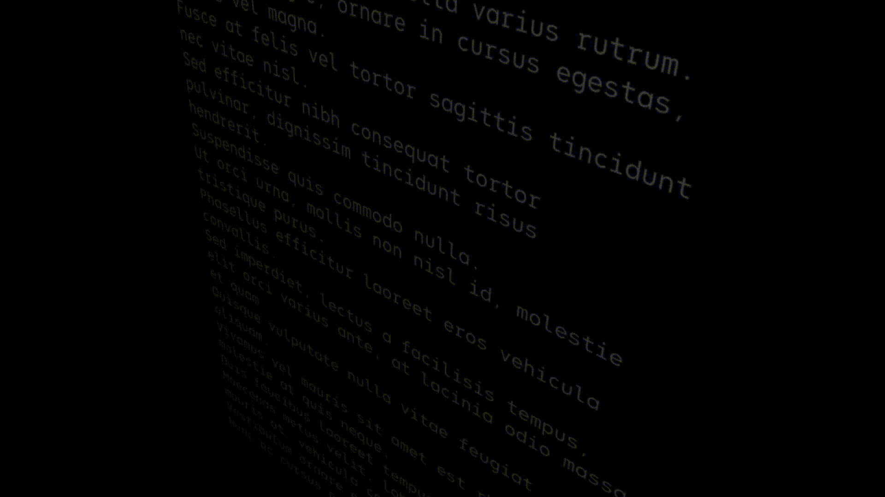

[](https://codecov.io/gh/gumob/three-text-geometry)

# three-text-geometry

<!--  -->


The port of the JavaScript versions of [three-bmfont-text](https://github.com/Jam3/three-bmfont-text), [layout-bmfont-text](https://github.com/Jam3/layout-bmfont-text), [load-bmfont](https://github.com/Jam3/load-bmfont), and [word-wrapper](https://github.com/mattdesl/word-wrapper) to Pure Typescript, this library enables fast text rendering with Three.js and bitmap font.
The difference in rendering speed is noticeable when animations are enabled, and it runs 10x faster than canvas texture based text rendering.


## Requirements

- Three.js r134 or later

## Installation

#### Yarn

```
yarn add three-text-geometry
```

#### Node

```
node install three-text-geometry
```

## Usage


#### Usage of `TextGeometryOption`
| value | type | description | default | required |
|---|:---:|---|:---:|:---:|
| **font** | `BMFont` | The BMFont definition which holds chars, kernings, etc | undefined | true |
| **text** | `string` | The text to layout. Newline characters `\n` will cause line breaks | undefined | true |
| **width** | `number` | The desired width of the text box, causes word-wrapping and clipping in `WordWrapMode` mode. Leave as undefined to remove word-wrapping (default behaviour) | undefined | false |
| **mode** | `WordWrapMode` | A mode for word-wrapper; can be `WordWrapMode.Pre` (maintain spacing), or `WordWrapMode.NoWrap` (collapse whitespace but only break on newline characters), otherwise assumes normal word-wrap behaviour (collapse whitespace, break at width or newlines) | undefined | false |
| **align** | `TextAlign` | This can be `TextAlign.left`, `TextAlign.center` or `TextAlign.right` | `TextAlign.left` | false |
| **letterSpacing** | `number` | The letter spacing in pixels | 0 | false |
| **lineHeight** | `number` | The line height in pixels | font.common.lineHeight | false |
| **tabSize** | `number` | The number of spaces to use in a single tab | 4 | false |
| **start** | `number` | The starting index into the text to layout | 0 | false |
| **end** | `number` | The ending index (exclusive) into the text to layout | text.length  | false |
| **flipY** | `boolean` | Whether the texture will be Y-flipped | true | false |
| **multipage** | `boolean` | Whether to construct this geometry with an extra buffer containing page IDs. This is necessary for multi-texture fonts | false | false |

## Generate Bitmap Font

#### Install [msdf-bmfont-xml](https://github.com/soimy/msdf-bmfont-xml)

```
npm install msdf-bmfont-xml -g
```

#### Generat Bitmap Font

```
msdf-bmfont \
    --output-type json \
    --filename 'OdudoMono-Regular' \
    --font-size 128 \
    --texture-size 1024,1024 \
    --field-type 'sdf' \
    'OdudoMono-Regular.otf'
```

## Copyright

Punycode is released under MIT license, which means you can modify it, redistribute it or use it however you like.